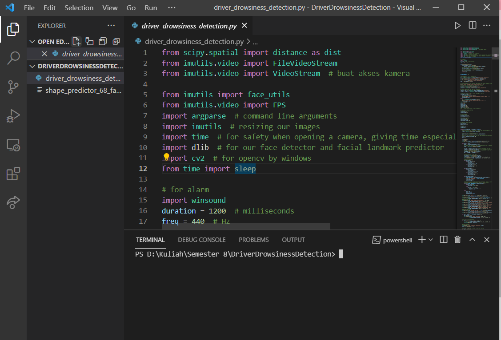
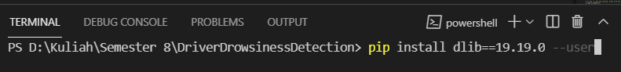
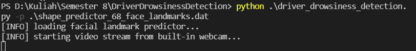
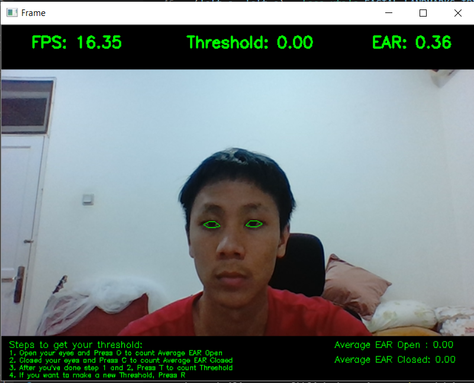

# DriverDrowsinessDetection
A python-based program for driver drowsiness detection using dlib for shape predictor and face detector. Camera is used for this program to detect either the driver is drowsy or not. It will send an alert text and beep sound if the driver is closing his/her eyes more than 2 seconds.

# Library (Explanation in Bahasa Indonesia)
1. VideoStream -> Mengakses kamera secara real-time
2. face_utils from imutils -> Mengonversi hasil output dari bentuk wajah yang didapatkan dari facial landmark predictor menjadi numpy array dan memudahkan kita untuk menghitung bounding box dari deteksi wajah tertentu dari model dlib berbasis HOG dan SVM Linear
3. imutils -> Mengubah ukuran dari gambar sesuai kebutuhan agar dapat mengurangi noise dan 
mempercepat pipeline berjalan
4. argparse -> Membuat command line arguments agar dapat secara spesifik menjalankan file yang 
mana dan model yang mana
5. time -> Memberikan delay agar kamera saat dibuka dapat menyesuaikan kualitas Frame yang 
rendah dan menyesuaikan kondisi cahaya
6. winsound -> Membunyikan suara saat _drowsy_ terdeteksi
7. dlib -> Menyediakan model face detector dan facial landmark predictor
8. cv2 -> Untuk opencv bindings
9. distance from scipy.spatial -> Melakukan perhitungan Eye Aspect Ratio (EAR)

# Steps of using the program

### 1. Downloading Section
1. Download the python program file -> driver_drowsiness_detection.py 
2. Download the shape predictor file -> shape_predictor_68_face_landmarks.dat
3. Place it into 1 folder and open the folder in your Visual Studio Code (VS Code)
4. Open the py file and open the terminal
5. Done! Your screen should look like this:

### 2. Install Package Section (Make sure that you are using python version 3)
Copy, paste, and enter each line below to the terminal like the image below:

1. pip install dlib==19.19.0 --user
2. pip install imutils==0.5.3 --user
3. pip install numpy==1.18.3 --user
4. pip install opencv-python==4.2.0.34 --user
5. pip install scipy==1.4.1 --user
6. pip install argparse==1.4.0 --user

### 3. Run the Program Section
1. At your own terminal at VS Code, type the script below
--> python ./driver_drowsiness_detection.py -p shape_predictor_68_face_landmarks.dat
and it will show like this at your terminal:

and it will pop the video camera like this:

## 4. Config the Dynamic EAR Threshold
By facing the camera, do these steps to get your own EAR Threshold:
1. Open your eyes widely and press O 
2. Closed your eyes and press C
3. Press T to count your threshold
4. Ready to detect your status! (Drowsy or Not)
5. To make a new EAR Threshold, press R and repeat step 1 to 3.

Thank You!

